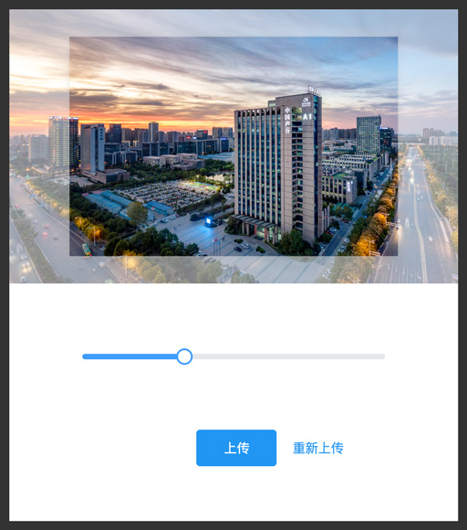

# vue-image-filler
图像[填充]剪裁工具 [ Vue Image clipping tool ]

`vue-image-filler` 是一款用于图像剪裁的工具，交互设计更为轻便简洁。与传统自由拖拽的图像剪裁工具不同的是，她更适用于限定输出尺寸的场景。

在常见的头像上传、缩略图生成、物料生成等功能皆可用它来完成。

**效果截图**



## 开发设置

你可以从 `dist` 目录选择适合你项目的模块文件，独立引入，当然我们更推荐你通过 `npm` 安装使用。

### 方式一、下载模块文件
- `vue-image-filler.es.js` 标准的 ES Module 版本，适合标准化的构建项目。
- `vue-image-filler.umd.js` 兼容 amd、cmd 模块及浏览器直接引入，若直接引入则会占用 `ImageFiller` 全局命名空间。

### 方式二、通过 `npm` 安装
``` shell
npm install vue-image-filler --save
```
``` javascript
// 第一步，引入模块
// es 引入方式
import ImageFiller from 'vue-image-filler'
// or 标准 node 模块引入
var ImageFiller = require('vue-image-filler')

// 第二步、注册模块
// 全局注册模块
Vue.use(ImageFiller)
// or 局部注册
new Vue({
  data: {
    // ...
  },
  components: {
    ImageFiller: ImageFiller
  },
  methods: {
    // ...
  }
})
```

## 如何使用

模版定义
``` html
<ImageFiller
  :width="900"
  :height="600"
  @confirm="handleFillerSuccuss"
/>
```
图像剪裁完成事件监听
``` javascript
handleFillerSuccuss: function (data) {
  console.log('fileBlob:	裁切画面对应的 blob 数据')
  console.log('file:		裁切画面文件，可直接用于上传保存')
  console.log('config:		裁切参数配置，可用于传递给其他服务，均是水平、垂直方向上的相对比值')
  console.log('------------------------')
  console.log(data)

  // 生成预览图片地址
  let previewImageUrl = URL.createObjectURL(data.fileBlob)
  // 上传剪裁后的文件
  let formData = new FormData()
  formData.append('upload', data.file)
}
```